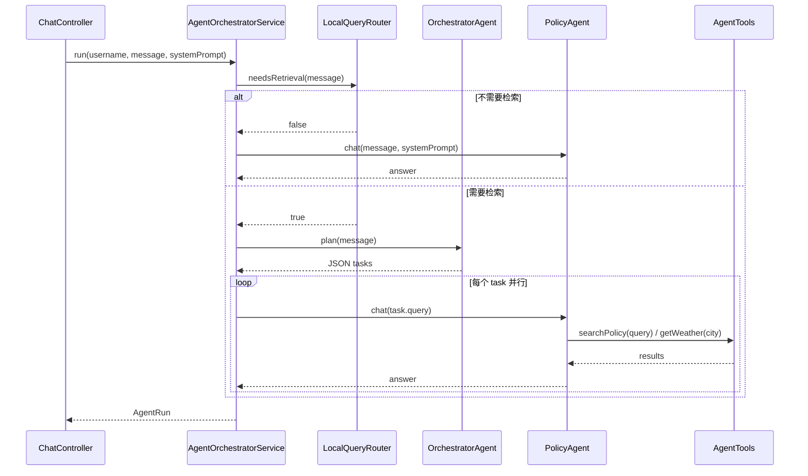

# Agent 单元 — Overview

## 单元摘要

多 Agent 协作系统，实现 Plan-Act-Observe-Reflect 执行循环，负责将用户问题路由到正确工具并生成答案。

## 需求背景

用户提问可能同时涉及公司政策查询、天气查询等多类型任务。需要一个可编排、可重试、可观测的 Agent 框架来处理复杂查询。

## 单元目标

1. 任务拆解（OrchestratorAgent）
2. 政策文档检索与回答（PolicyAgent + AgentTools.searchPolicy）
3. 工具执行监控与重试（actWithRetry）
4. 完整执行轨迹记录（AgentRun / AgentStep）

## 关键代码

| 文件 | 说明 |
|------|------|
| `agent/OrchestratorAgent.java:8` | LangChain4j AI Service 接口，负责任务拆解，返回 JSON |
| `agent/PolicyAgent.java:8` | LangChain4j AI Service 接口，同步 `chat()` + 流式 `streamChat()`，**注册了所有工具** |
| `agent/SummaryAgent.java` | 汇总 Agent，将多信息源整合为专业答案 |
| `agent/HumanInLoopAgent.java:20` | 人工确认 Agent，危险工具（sendEmail、deleteData 等）执行前阻塞等待用户批准 |
| `agent/AgentTools.java:32` | `@Tool` 注册点：`searchPolicy`、`getWeather`、`sendEmail` |
| `service/AgentOrchestratorService.java:84` | 主执行方法 `run(username, userMessage, systemPrompt)` |
| `service/MultiAgentService.java` | 并行调度 OrchestratorAgent + PolicyAgent + SummaryAgent |
| `agent/runtime/AgentRun.java` | 执行记录：runId、status、steps、finalAnswer |
| `agent/runtime/AgentStep.java` | 单步记录：stepId、sequence、toolName、status、latencyMs |
| `agent/runtime/AgentErrorCode.java` | 错误码：TOOL_TIMEOUT、TOOL_VALIDATION_FAIL、MAX_STEPS_EXCEEDED、NO_RELEVANT_CONTEXT |
| `agent/tool/ToolExecutionWrapper.java:44` | 工具执行包装器：反射调用、超时控制、工具级重试、方法缓存 |
| `agent/tool/ToolRetryStrategy.java` | 工具级重试策略：searchPolicy(2次)、sendEmail(0次，有副作用)、getWeather(2次) |
| `agent/tool/ToolExecutionStats.java` | 原子计数统计：成功率、失败率、耗时（AtomicInteger/AtomicLong）|
| `agent/tool/ToolExecutionMonitor.java` | SLA 监控：successRate < 95% 时告警，推荐超时调整 |
| `agent/tool/RetryableErrorType.java` | 错误分类：RETRYABLE_IMMEDIATE / WITH_BACKOFF / NOT_RETRYABLE |
| `agent/invoker/ModelClientFactory.java` | 创建 OpenAI-compatible 或 Anthropic 客户端 |
| `agent/invoker/ModelInvoker.java` | 熔断包装：CircuitBreaker + 降级到 Ollama |

## 入口与边界

- **入口**：`ChatController.chat()` 和 `ChatController.stream()` 调用 `AgentOrchestratorService.run()`
- **出口**：返回 `AgentRun`，包含 `getFinalAnswer()` 和 `getSteps()`
- **边界**：最多 `maxSteps=3` 步，每步超时 `stepTimeoutMs=15000ms`，重试 `retryTimes=1` 次

## 核心编排

`AgentOrchestratorService.run()` 执行流：

```
1. LocalQueryRouter.needsRetrieval(msg)
   ├─ false → PolicyAgent.chat() 直接回答（不走 RAG）
   └─ true  → 走 Plan 阶段

2. OrchestratorAgent.plan(msg) → JSON { tasks: [{type, query}...] }
   ├─ 解析出多个 task → executeTasks() 并行执行（CompletableFuture）
   │   ├─ type=weather → 内置天气字符串（TODO：真实 API）
   │   └─ type=policy → PolicyAgent.chat(query)
   └─ 解析失败 / 单任务 → 回退到单步循环

3. 单步循环（最多 maxSteps 次）：
   ├─ act: actWithRetry() → invokeWithTimeout() → PolicyAgent.chat()
   ├─ observe: step.markSuccess()
   ├─ 成功 → run.markSuccess(answer)
   └─ 失败 → reflect() → 调整 workingMessage → 继续下一步

4. 超出最大步数 → run.markFailed()
```

## 规则与约束

- `OrchestratorAgent` 只返回纯 JSON，不含其他文本（```json 包裹时会被 `replaceAll` 清理）
- task type 为 `none` 或 `unknown` 时跳过，不执行
- 工具调用前必须经过 `ToolPolicyGuardService.checkToolAccess(toolName)` 权限检查
- `LocalQueryRouter` 使用本地 Ollama 模型（llama3.2:3b）做前置分类，节省 DeepSeek token

## 数据与集成

- **PolicyAgent** → LangChain4j → DeepSeek API（`app.models.primary`）
- **AgentTools.searchPolicy** → `HybridSearchService.hybridSearch(query, 3)` → pgvector + PostgreSQL 全文检索
- **Tracer** → Micrometer + Jaeger 链路追踪，span name = `agent.orchestrator.run`
- **AgentMetrics** → Micrometer，记录 `recordSuccess(latency)` / `recordFailure()`

## 核心时序



## 风险与未知项

- **[Author's analysis]** `getWeather` 工具返回硬编码字符串，未接入真实天气 API
- `LocalQueryRouter` 依赖本地 Ollama（**phi3:mini**），若 Ollama 未启动会导致所有请求失败
- `executeTasks` 中的 `CompletableFuture.allOf().join()` 无超时控制，可能阻塞
- `ToolExecutionWrapper` 通过反射调用工具方法，第一次调用后结果缓存到 ConcurrentHashMap（methodCache）
- `HumanInLoopAgent` 依赖 `scanner.nextLine()` 阻塞等待，仅适用于 CLI/测试场景，不适合生产 HTTP 接口
- 工具级重试策略（`ToolRetryStrategy`）：sendEmail 重试 0 次（防重复发送），searchPolicy / getWeather 最多重试 2 次
