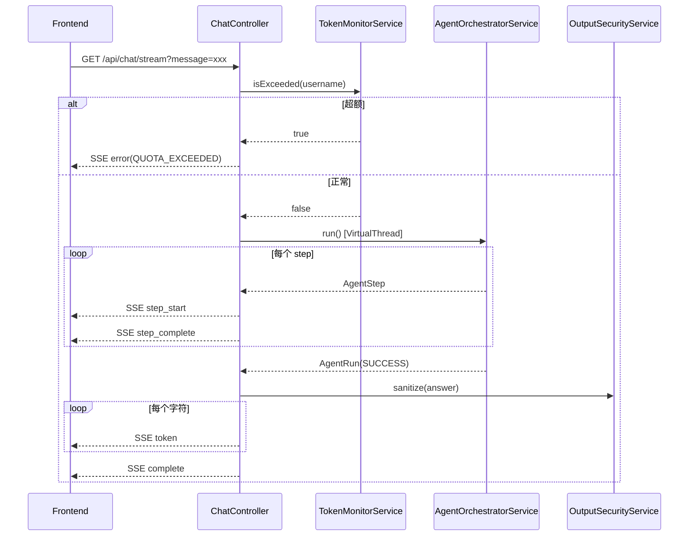

# Chat 单元 — Overview

## 单元摘要

提供两种对话接口：同步 POST `/api/chat`（返回 JSON）和流式 GET `/api/chat/stream`（SSE），均经过 Token 配额检查、Agent 编排和输出安全过滤。

## 需求背景

用户通过前端输入问题，后端调用 Agent 系统获取答案，支持实时流式展示（字符级 token 推送）以提升体验。

## 单元目标

1. 接收用户消息，检查 Token 配额
2. 调用 `AgentOrchestratorService.run()` 执行 Agent 编排
3. 流式接口逐字符推送答案，同步接口返回完整 JSON
4. 输出安全过滤（`OutputSecurityService.sanitize()`）

## 关键代码

| 文件 | 行号 | 说明 |
|------|------|------|
| `controller/ChatController.java:80` | 同步 `POST /api/chat` |
| `controller/ChatController.java:133` | 流式 `GET /api/chat/stream` |
| `controller/ChatController.java:71` | `GET /api/usage` 查询用量 |
| `controller/AgentStreamEvent.java` | SSE 事件类型定义 |
| `controller/ChatResponse.java` | 同步响应 record |
| `service/PromptService.java` | 按 key 加载 systemPrompt |
| `service/OutputSecurityService.java` | 输出内容安全过滤 |
| `config/AgentRuntimeProperties.java` | `includeTraceInResponse` 控制是否返回步骤详情 |

## 入口与边界

- **同步入口**：`POST /api/chat`，body `{"message": "..."}`
- **流式入口**：`GET /api/chat/stream?message=xxx`，需 JWT token（header 或 query param）
- **SSE 超时**：60 秒（`new SseEmitter(60_000L)`）
- **输出过滤**：所有 `finalAnswer` 都经过 `outputSecurityService.sanitize()`

## 前置条件

1. JWT 鉴权通过（`JwtAuthFilter` 或 `EnterpriseJwtAuthFilter`）
2. `TokenMonitorService.isExceeded(username)` 返回 false

## 调用链

```
POST /api/chat
  → ChatController.chat()
  → tokenMonitorService.isExceeded(username) [配额检查]
  → promptService.getPrompt("policy_agent", DEFAULT_PROMPT)
  → agentOrchestratorService.run(username, message, systemPrompt)
  → outputSecurityService.sanitize(finalAnswer)
  → ResponseEntity<ChatResponse | Map>

GET /api/chat/stream
  → ChatController.stream()
  → tokenMonitorService.isExceeded(username) [配额检查]
  → executor.submit(VirtualThread)
    → agentOrchestratorService.run()
    → 逐 step 发送 SSE: step_start, step_complete
    → 逐字符发送 SSE: token
    → 发送 SSE: complete | error
```

## SSE 事件类型（AgentStreamEvent）

| 事件名 | 数据类型 | 说明 |
|--------|----------|------|
| `step_start` | `StepStartEvent(stepId, sequence, toolName, inputSummary)` | 步骤开始 |
| `step_complete` | `StepCompleteEvent(stepId, sequence, status, latencyMs, outputSummary)` | 步骤完成 |
| `token` | `String`（单字符）| 答案逐字符推送 |
| `complete` | `CompleteEvent(runId, answer, steps, latencyMs)` | 全部完成 |
| `error` | `ErrorEvent(runId, message, errorCode)` | 失败或配额超限 |

## 请求与字段

**POST /api/chat** request body：
```json
{ "message": "北京打车报销标准是多少？" }
```

**POST /api/chat** response（includeTrace=false）：
```json
{ "answer": "..." }
```

**POST /api/chat** response（includeTrace=true）：
```json
{
  "answer": "...",
  "runId": "uuid",
  "status": "SUCCESS",
  "totalLatencyMs": 3200,
  "totalSteps": 2,
  "startedAt": "...",
  "endedAt": "...",
  "steps": [...]
}
```

## 状态变化

- Token 超额 → HTTP 429 / SSE `error(QUOTA_EXCEEDED)`
- Agent 成功 → HTTP 200 / SSE `complete`
- Agent 失败 → HTTP 500 / SSE `error(INTERNAL_ERROR)`

## 时序图



## 风险与未知项

- `DEFAULT_PROMPT` 硬编码在 `ChatController.java:39`，生产应由 `PromptService` 管理
- SSE 流式接口未实现真正的逐 token 流（先等 `AgentRun` 完成，再逐字符切分），非真实流式
- **[Author's analysis]** SecurityContext 在 VirtualThread 中通过 `SecurityContextHolder.setContext(context)` 手动传递，线程结束后 `clearContext()`，设计合理
