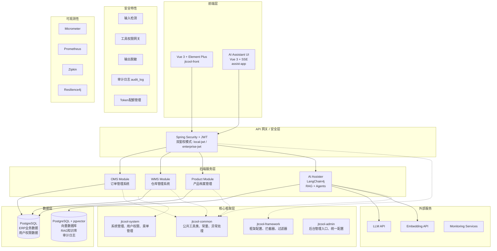

# JTCool ERP + AI Assistant 系统架构

## 系统架构图

```mermaid
graph TB
    subgraph Frontend["前端层"]
        FE1[Vue 3 + Element Plus<br/>jtcool-front]
        FE2[AI Assistant UI<br/>Vue 3 + SSE<br/>assist-app]
    end

    subgraph Gateway["API 网关 / 安全层"]
        GW[Spring Security + JWT<br/>双鉴权模式: local-jwt / enterprise-jwt]
    end

    subgraph Backend["后端服务层"]
        OMS[OMS Module<br/>订单管理系统]
        WMS[WMS Module<br/>仓库管理系统]
        PROD[Product Module<br/>产品档案管理]
        AI[AI Assister<br/>LangChain4j<br/>RAG + Agents]
    end

    subgraph Database["数据层"]
        DB1[(PostgreSQL<br/>ERP业务数据<br/>用户权限数据)]
        DB2[(PostgreSQL + pgvector<br/>向量数据库<br/>RAG知识库<br/>审计日志)]
    end

    subgraph Framework["核心框架层"]
        COMMON[jtcool-common<br/>公共工具类、常量、异常处理]
        FW[jtcool-framework<br/>框架配置、拦截器、过滤器]
        SYS[jtcool-system<br/>系统管理、用户权限、菜单管理]
        ADMIN[jtcool-admin<br/>后台管理入口、统一配置]
    end

    subgraph External["外部服务"]
        LLM[LLM API]
        EMB[Embedding API]
        MON[Monitoring Services]
    end

    subgraph Security["安全特性"]
        SEC1[输入检测]
        SEC2[工具权限网关]
        SEC3[输出脱敏]
        SEC4[审计日志 audit_log]
        SEC5[Token配额管理]
    end

    subgraph Observability["可观测性"]
        OBS1[Micrometer]
        OBS2[Prometheus]
        OBS3[Zipkin]
        OBS4[Resilience4j]
    end

    FE1 --> GW
    FE2 --> GW
    GW --> OMS
    GW --> WMS
    GW --> PROD
    GW --> AI

    OMS --> DB1
    WMS --> DB1
    PROD --> DB1
    AI --> DB2

    AI --> LLM
    AI --> EMB

    OMS -.-> COMMON
    WMS -.-> COMMON
    PROD -.-> COMMON
    AI -.-> COMMON

    GW -.-> FW
    Backend -.-> SYS
```

